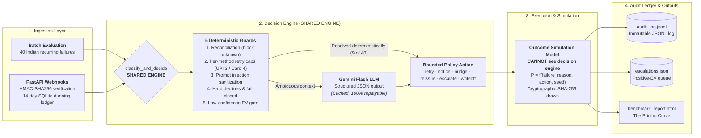

# Project Context - Razorpay AI Buildathon Track 3

## System Overview
Failed Subscription Recovery Agent evaluating 40 realistic Indian recurring payment failures across 7 benchmark strategies, tested against an independent outcome simulation model across 200 paired seeds.

## System Architecture

## Core Modules
- `outcome_model.py`: Ground-truth outcome simulation. Uses independent `RECOVERY_MATRIX`, exponential attempt decay (`0.75^(attempts-1)`), action unit costs, and RBI/network compliance violation penalties. Outcomes are cryptographically seeded via SHA-256 for deterministic reproducibility.
- `strategies.py`: Decoupled strategy definitions for all 7 benchmark baselines (`no_action`, `always_retry`, `message_only`, `naive_rules`, `agent_rules`, `agent_llm`, `oracle`). Includes persistent decision cache (`llm_decision_cache.json`) for zero-API reproducibility.
- `pipeline.py`: Universal execution engine providing CLI flags (`--benchmark`, `--sweep-penalty`, `--rules-only`, and three demo flags). Enforces universal out-of-scope filtering and idempotency deduplication.
- `models.py`: Pydantic data schemas (`FailedPayment`, `InterventionDecision`, `AuditEntry`).
- `config.yaml`: Declarative policy configuration defining per-method retry caps (`upi: 3`, `card: 4`), hard decline reasons, deduplication TTL, and RBI AFA thresholds.
- `data/sample_batch.py`: 40-record sample dataset covering 9 Indian failure reasons, tiered pricing (₹199 to ₹9,999), and specific edge cases.
- `tests/test_guards.py`: Pytest suite verifying safety guards, compliance penalties, reconciliation checks, and deterministic seeded outcomes.

## Benchmark Summary (40 Records, 200 Paired Seeds, ₹98,952 at Risk)
- **oracle**: Mean Net ₹27,509.45 | 29.6% Gross | Reference Upper Bound (Reads outcome matrix)
- **naive_rules**: Mean Net ₹24,154.31 | 28.7% Gross | 6 Violations (₹3,000 penalty at ₹500/violation)
- **agent_rules**: Mean Net ₹21,822.29 | 23.1% Gross | 0 Violations (100% compliant)
- **agent_llm**: Mean Net ₹21,537.24 | 22.2% Gross | 0 Violations (Paired diff vs agent_rules: -₹285.05 ± ₹570.06)
- **message_only**: Mean Net ₹16,993.97 | 17.2% Gross | 0 Violations
- **always_retry**: Mean Net ₹5,016.53 | 13.2% Gross | 16 Violations
- **no_action**: Mean Net ₹0.00 | 0.0% Gross | 0 Violations

## The Compliance Pricing Curve
- **₹62.08 per violation**: The cheapest violation stops paying (`pay_Ex66fGhIjKlM65`, ₹899, insufficient_funds). Below ₹62, no violation is deterred.
- **₹888.67 per violation**: Exact derived break-even penalty where `agent_rules` overtakes `naive_rules`. `naive_rules` is unchanged at ₹24,154.31; `agent_rules` rose by ₹145.01 via the EV gate, shrinking the performance gap so the crossing arrives earlier.
- **₹1,351.22 per violation**: Oracle compliance threshold where an unconstrained profit-maximiser abandons violations entirely (`pay_Ex11kLmNoPqR10`, ₹9,999, gateway_timeout at retry cap). Above ₹1,351, nothing pays.
*(All three thresholds derived programmatically from the 40-record batch and are batch-specific).*
