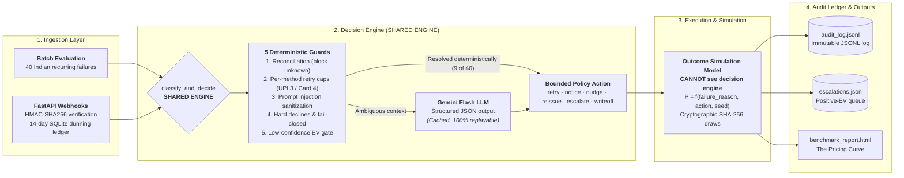
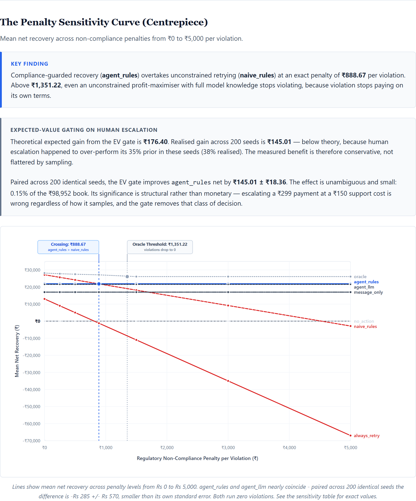

# Failed Subscription Recovery Agent — Razorpay Buildathon Track 3

Measured net recovery on a 40-record batch of failed Indian recurring
payments, evaluated against 6 baselines and a hidden oracle across 200
seeded draws.

## Headline results

| | |
|---|---|
| Revenue at risk | ₹98,952 |
| Agent net recovered (mean, 200 seeds) | **₹21,822** |
| Gross recovery rate | 23.1% |
| Compliance violations | **0** |
| Oracle upper bound | ₹27,509 |
| Naive always-retry | ₹5,017 |

All recovery outcomes are **simulated** under an explicit probability
model (`outcome_model.py`). No live merchant money was recovered.

## Architecture




*The compliance pricing curve. Generated offline by python pipeline.py --benchmark — no API key, no server.*

## The finding: compliance has a price, and I derived it

The non-compliant legacy rulebook (`naive_rules`) recovers **more** money
than the compliant agent when an RBI violation is priced at ₹500 —
₹24,154 versus ₹21,822 — because it pays 6 violations and still comes out
ahead.

The exact break-even is **₹888.67 per violation.** Below that price,
non-compliance is economically rational. At or above it, the agent wins.
`naive_rules` is unchanged at ₹24,154.31; `agent_rules` rose from ₹21,677.28
to ₹21,822.29 after eliminating money-losing micro-ticket escalations, shrinking
the gross margin gap from ₹5,477.03 to ₹5,332.02. Divided across 6 regulatory
violations, the crossing arrives earlier. Operational efficiency is the mechanism;
the shrinking gap is the cause.

| Penalty | Best deployable strategy |
|---|---|
| ₹0 – ₹500 | naive_rules |
| ₹889+ | **agent_rules** |

### The compliance pricing curve

Across the 40-record evaluation batch, three distinct regulatory penalty thresholds emerge programmatically:

1. **₹62.08 per violation** — *The cheapest violation stops paying.*
   Below ₹62.08, no non-compliant retry is deterred; every unlawful retry yields higher net expected margin than its best compliant alternative. At ₹62.08, `pay_Ex66fGhIjKlM65` (₹899, `insufficient_funds`) ceases to be profitable to retry unlawfully and switches to compliant notice reissuance.
2. **₹888.67 per violation** — *The compliant agent overtakes the non-compliant rulebook.*
   At ₹888.67, `agent_rules` (₹21,822.29) overtakes `naive_rules`. Between ₹889 and ₹1,351, compliance is the superior system-wide policy while individual high-value violations remain locally profitable.
3. **₹1,351.22 per violation** — *An unconstrained profit-maximiser abandons violation entirely.*
   Above ₹1,351.22, even an omniscient profit-maximising Oracle with full model knowledge incurs 0 violations. Driven by the highest-ticket violation in the batch (`pay_Ex11kLmNoPqR10`, ₹9,999, `gateway_timeout` at retry cap), beyond this penalty nothing pays.

*(All three thresholds are derived programmatically from this 40-record batch and are batch-specific, not general constants).*

### Expected-value gating on human escalation

Theoretical expected gain from the EV gate is ₹176.40. Realised gain across 200 seeds is ₹145.01 — below theory, because human escalation happened to over-perform its 35% prior in these seeds (38% realised). The measured benefit is therefore conservative, not flattered by sampling.

Paired across 200 identical seeds, the EV gate improves `agent_rules` net by **₹145.01 ± ₹18.36**. The effect is unambiguous and small: 0.15% of the ₹98,952 book. Its significance is structural rather than monetary — escalating a ₹299 payment at a ₹150 support cost is wrong regardless of how it samples, and the gate removes that class of decision.

Two consequences worth stating plainly:

1. **The compliant strategies are penalty-invariant.** `agent_rules`
   returns ₹21,822.29 whether a violation costs ₹0 or ₹5,000, because it
   never incurs one. Regulatory risk exposure is zero, not small.
2. **Always-retry is value-destroying, not merely weak.** It falls from
   ₹13,017 to **negative ₹66,983** across the same range — destroying
   two-thirds of the merchant's book on a ₹98,952 exposure.

I do not claim ₹500 is the right price. I claim that a merchant must
decide what an unauthorised debit attempt costs them, and that ₹889 is
where that decision flips.

## Full benchmark — 7 strategies, 200 paired seeds

See `benchmark_results.md`. Reproduce with `python pipeline.py --benchmark`
— **no API key required**, decisions replay from `llm_decision_cache.json`.

## Does the LLM earn its place? Measured, not assumed

`agent_llm` composition: 31 live Gemini decisions / 0 cache misses /
7 resolved by deterministic guard before any model call.

Paired difference versus `agent_rules`: **-₹285.05 ± ₹570.06** across 200 seeds.

The difference (-₹285.05) is smaller than its own standard error (± ₹570.06) across 200 paired seeds.

The LLM substitutes messaging for retrying: 4 retries versus the rule engine's 8, but 24 customer contacts versus 16. It trades debit attempts for customer friction and nets out flat. Oracle decision match is 73.7% for rules versus 60.5% for the LLM — the deterministic engine is closer to optimal, not merely cheaper.

22% of records never reach the model at all: retry-exhaustion and
reconciliation guards resolve them deterministically at zero inference
cost. The model is consulted where failure context is genuinely
ambiguous, not as a router for cases an `if` statement decides.

## How it works

Batch → Pydantic validation → five deterministic guards → decision
(Gemini structured output, or rules) → independent outcome model →
audit ledger (`audit_log.jsonl`) + financial counters.

**The outcome model cannot see the decision engine, and vice versa.**
Recovery probability is a property of `(failure_reason, action, seed)`,
never of the action label alone. This is what makes the agent's choice
scoreable rather than self-fulfilling — an earlier version derived
payout from the chosen action, which meant "always retry" would have
scored highest by construction.

## Five deterministic safety guards

1. **Reconciliation** — `payment_state` of `unknown` or
   `possibly_debited` forces escalation. Retrying a payment that may
   already have debited risks a double charge; this runs *before* the model.
2. **Retry exhaustion** — per-method caps (`upi: 3`, `card: 4`), not a
   flat number, reflecting differing network retry limits.
3. **Prompt injection defence (Guard 5)** — untrusted merchant notes
   are sanitized against direct instruction overrides and base64 payloads;
   flagged records are withheld and routed to human review.
4. **Hard declines & Fail-closed** — hard declines (`issuer_declined`,
   `mandate_lapsed_on_reissue`) escalate immediately; an outage or degraded
   mode never emits an autonomous money-moving debit.
5. **Low-confidence escalation** — below threshold, route to a human.

## Closed-Loop Recovery Campaign (ReAct Lifecycle)

The agent doesn't stop at single-pass classification. Under `--campaign`,
unrecovered non-terminal records re-enter subsequent retry windows
(Cycle 1 → Cycle 4):
- `attempt_count` increments with real attempt decay.
- Cycle audit notes accumulate: `[Cycle X: tried <action>, unrecovered]`.
- As attempts approach retry caps, the policy dynamically shifts away from
  `retry_now` toward customer communications, human review, or writeoff.

## The 9 India-specific failure reasons

`upi_pin_failure` · `insufficient_funds` · `card_expired` ·
`mandate_not_registered` · `mandate_lapsed_on_reissue` ·
`afa_required_not_completed` (RBI AFA above ₹15,000) ·
`pre_debit_notice_not_acked` (RBI 24-hour notice) · `gateway_timeout` ·
`issuer_declined`

Retrying an unacknowledged pre-debit notice is a regulatory violation,
not merely an ineffective action. The outcome model prices it as one.

## Run it

```bash
pip install -r requirements.txt
python pipeline.py --rules-only             # run compliant agent with audit export
python pipeline.py --audit-summary          # parse and summarize audit_log.jsonl
python pipeline.py --campaign               # closed-loop multi-cycle recovery lifecycle
python pipeline.py --demo-injection         # Guard 5 prompt injection defence demo
python pipeline.py --benchmark              # full evaluation, no API key (HTML + MD)
python pipeline.py --sweep-penalty          # sensitivity analysis
pytest tests/                               # 38 tests across guards, campaign, outcome model, webhook
python pipeline.py --demo-retry-exhaustion
python pipeline.py --demo-out-of-scope
python pipeline.py --demo-low-confidence
```

## On held-out evaluation

No parameter in the outcome model is fitted to this batch. Recovery
probabilities are stated domain priors calibrated against published
industry retry-recovery rates, not learned from the evaluation data.
A train/test split guards against overfitting to the evaluation set;
with no fitted parameters there is no leakage to guard against.
Statistical confidence instead comes from 200 paired seeds with
reported standard errors.

## What broke and how I fixed it

**The metric was circular.** The first version computed recovery as
`amount × rate[chosen_action]`. Since the agent picked the action, it
could not be wrong, and "always return retry_now" would have scored
highest. The reported 35.5% recovery rate measured nothing. Rebuilt as
an independent outcome model keyed on `(failure_reason, action, seed)`.
The honest number came out at 23.1%.

**The LLM path was measuring its own fallback.** Free-tier quota
exhausted mid-batch; 11 of 31 records silently fell through to rules,
and the "LLM" benchmark row was 53% not-the-LLM. Fixed with a persistent
decision cache, exponential backoff, and a composition line printed on
every run. The cache is committed so the benchmark is reproducible
without a key.

**Rules were labelled as model calls.** Seven records intercepted by the
retry-exhaustion guard printed "Calling Gemini API" before the guard ran.
No call was made. Moved the log after the guards.

**Retrying an unacknowledged pre-debit notice.** The original rulebook
mapped `pre_debit_notice_not_acked` to `retry_now`, bundled with
`gateway_timeout`. That is an RBI violation. Split out and routed to
`resend_pre_debit_notice`.

## Live Webhook Ingestion & Multi-Attempt Dunning Continuity

In addition to batch simulation, the system provides a production-grade FastAPI receiver (`app.py`) with:
- **HMAC-SHA256 Signature Verification** (`X-Razorpay-Signature`).
- **Idempotency Ledger**: Deduplication of duplicate webhook events within `dedupe.ttl_hours` (72h).
- **Multi-Attempt State Continuity**: SQLite ledger tracking sequential failures per `subscription_id` within `dedupe.dunning_window_hours` (336h = 14 days). Rather than evaluating each webhook in isolation, accumulated attempt counts feed into Guard 2 (per-method retry caps).
- **Public Subscription Audit Endpoint**: `GET /subscriptions/{subscription_id}` exposes the complete chronological sequence of webhook events and recovery actions taken during the dunning cycle.
- **Verified Error Normalization** (`error_normalizer.py`): Maps verified Razorpay public gateway codes (`card_declined`, `card_expired`, `payment_timed_out`, `gateway_technical_error`, `bank_technical_error`, `GATEWAY_ERROR`) into the internal 9-reason taxonomy. Ambiguous or unverified codes (such as `payment_declined` and `payment_risk_check_failed`) are strictly rejected out-of-scope to deterministic write-off by design rather than guessed.

To demonstrate multi-attempt state continuity and accumulated retry cap exhaustion:
```bash
python pipeline.py --replay-dunning
```
Output:
`Attempt 1: retry_now` → `Attempt 2: retry_now` → `Attempt 3: stop_and_writeoff [GUARD TRIGGERED: retry_cap]`.

## Limitations

- All outcomes simulated; probabilities are stated domain priors in
  `outcome_model.py`, not fitted to merchant history.
- 40 records. Wide per-seed variance — comparisons use
  paired per-seed differences with standard errors, not raw ranges.
- No live external dispatch to WhatsApp/SMS (mocked to communication logs).

