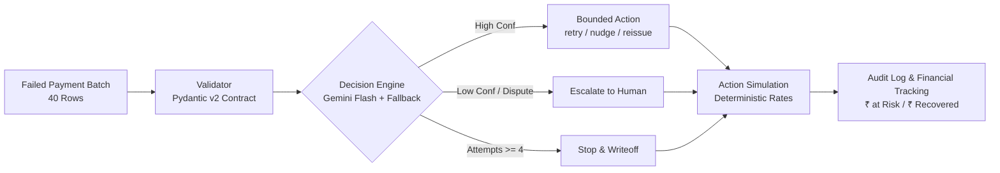

# Failed Subscription Recovery Agent – Razorpay Buildathon (Track 3)

## Batch Performance (40 Records)
| Metric | Value |
|---|---|
| **Batch Size** | 40 transactions |
| **Total Amount at Risk** | ₹98,952.00 |
| **Simulated Recovery** | ₹35,150.94 |
| **Recovery Rate** | **35.5%** |
| **Action Breakdown** | `retry_now` (12), `escalate_to_human` (7), `request_mandate_reissue` (6), `send_upi_pin_nudge` (5), `send_card_update_link` (4), `stop_and_writeoff` (4) |
| **Failure Safety Modes** | Retry Exhaustion (4), Out-of-Scope Rejection (2), Low-Confidence Escalation |

---

## What It Is
An automated, bounded recovery pipeline for recurring Indian subscription payments (UPI AutoPay, Card e-Mandates, NACH) that classifies failure root causes via LLM + deterministic fallback, executes targeted interventions, and tracks financial metrics with a complete audit trail.

---

## How to Run

### Standard 40-Row Batch Execution
```bash
# from recovery_agent/ (with .venv active)
# Uses Gemini Flash with automatic rule fallback
python pipeline.py

# Instant deterministic run without LLM API calls
python pipeline.py --rules-only
```

### Video Pitch Demo Modes (100% Deterministic & Instant)
```bash
# Demo 1: Retry Exhaustion (attempt_count >= 4 -> terminal writeoff)
python pipeline.py --demo-retry-exhaustion

# Demo 2: Out-of-Scope / Malformed Failure Reason Rejection
python pipeline.py --demo-out-of-scope

# Demo 3: Low-Confidence / Disputed Transaction Escalation
python pipeline.py --demo-low-confidence
```

---

## Architecture



1. **Data Ingestion**: Ingests realistic recurring payment failures across Indian subscription price points (₹199 to ₹9,999).
2. **Schema Contract**: Pydantic v2 model validates and enforces the 9 India-specific failure reasons.
3. **Hybrid Decision Engine**: Google Gemini Flash structured JSON output (`response_schema=InterventionDecision`) with zero-downtime deterministic rule-based fallback.
4. **Action Execution & Simulation**: Applies bounded actions with action-specific recovery rates (50%–70%).
5. **Audit Trail**: Every record is timestamped, audited with reason and confidence, and financial counters are aggregated.

---

## 9 India-Specific Failure Reasons Handled
1. `upi_pin_failure` – Customer entered wrong UPI MPIN on auto-debit prompt.
2. `insufficient_funds` – Low account balance during salary/recurring cycle.
3. `card_expired` – Card validity expired; requires tokenized card update.
4. `mandate_not_registered` – Bank-side recurring e-mandate registration missing.
5. `mandate_lapsed_on_reissue` – Card replaced but updated e-mandate not authenticated.
6. `afa_required_not_completed` – RBI Additional Factor of Authentication (OTP > ₹15k) abandoned.
7. `pre_debit_notice_not_acked` – 24-hour mandatory pre-debit notification unacknowledged.
8. `gateway_timeout` – Transient NPCI or acquiring bank switch timeout.
9. `issuer_declined` – Card issuing bank risk/velocity decline or disabled e-commerce.

---

## 3 Triggerable Failure Modes (Live Safety)
- **1. Retry Exhaustion (`attempt_count >= 4`)**: Halts recurring retries and forces `stop_and_writeoff` to prevent unnecessary merchant fees and customer spam.
- **2. Out-of-Scope / Malformed**: Catches unsupported/off-rail failure reasons (e.g. `crypto_wallet_declined`, `cheque_bounce_physical`) and creates a clean `rejected_out_of_scope` audit entry without crashing.
- **3. Low-Confidence Escalation**: If decision confidence is `< 0.60` or customer disputes unauthorized charges, automatically forces `escalate_to_human`.

---

## What Is Not Done / Next (Engineering Scope & Roadmap)
- **Live Razorpay Webhook Ingestion vs. Batch Scope**: Operating in batch mode was a deliberate architecture decision for the 6-day buildathon window to first prove deterministic failure classification, bounded interventions, measured ₹ recovery, and failure recovery modes before adding network listeners. The immediate production step is wrapping `process_batch` in a FastAPI async endpoint receiving `payment.failed` and `subscription.halted` webhooks.
- **Omnichannel Dispatch Integration**: Connect action outputs (`send_upi_pin_nudge`, `send_card_update_link`) directly to live WhatsApp Business API and SMS gateways for interactive one-click customer resolution.
- **Persistent Database Store**: Migrate in-memory audit logs to a persistent Postgres/Supabase schema with merchant dashboard views.
- **Dynamic Policy Reinforcement**: Introduce multi-armed bandit / RL to optimize recovery retry windows based on historical customer payment behavior and bank-level settlement patterns.
